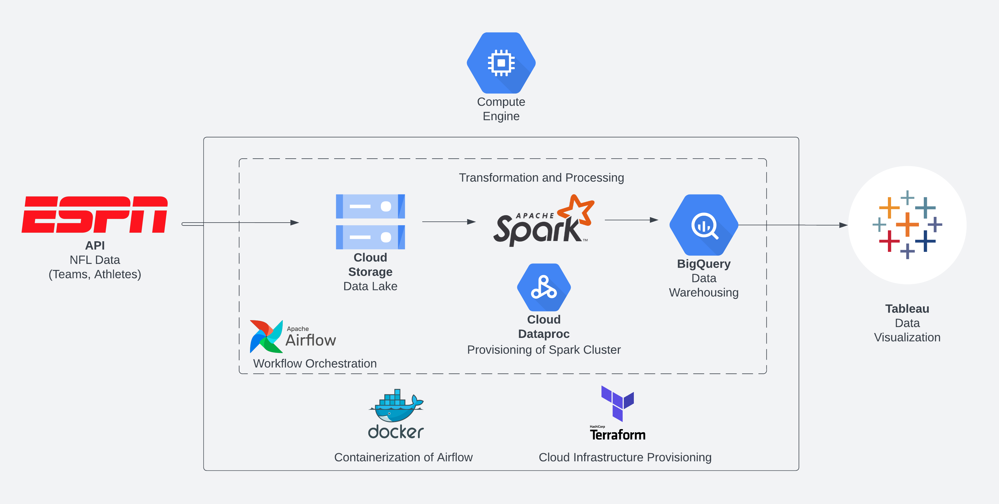
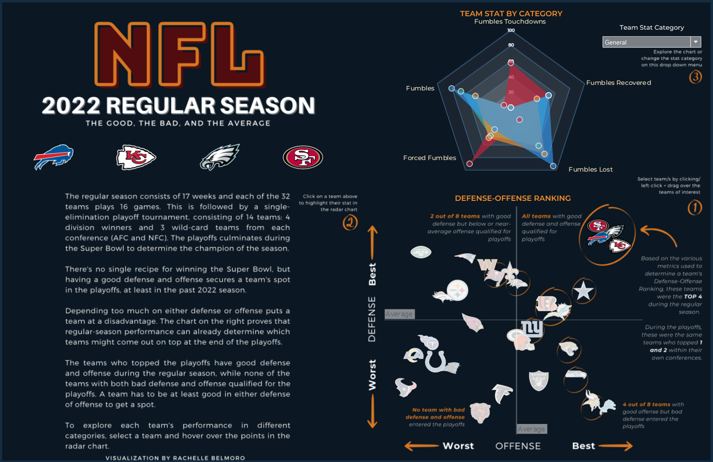

# NFL DATA ENGINEERING PROJECT

##  Goal
- Build an end-to-end data pipeline
  - Ingesting the data from multiple [ESPN API endpoints](https://gist.github.com/nntrn/ee26cb2a0716de0947a0a4e9a157bc1c)
  - Directly loading the result to Google Cloud Storage (Data Lake)
  - Transforming the data using Pyspark
  - Loading the transformed data to BigQuery (Data Warehouse)
  - Visualize the data using Tableau
    

## **Problem description**
 - The regular season of the National Football League (NFL) consists of 17 weeks and each of the 32 teams plays 16 games. This is followed by a single-elimination playoff tournament, consisting of 14 teams: 4 division winners and 3 wild-card teams from each conference (AFC and NFC). The playoffs culminates during the Super Bowl to determine the champion of the season.

 - Regular season data can give us a glimpse of what could happen in the playoffs. If we want to bet on which team's going to win the Super Bowl, we might as well look at how they performed in the regular season. This project wanted to answer the following questions using the 2022 Regular Season NFL data:

 ### Weakness and Strength of the Team

   - Each team has different stat categories (Passing, Defense, Rushing, Receiving, Scoring, General, Kicking) which can be used to assess their performance.
   - This project aims to get the percentile rank of each team for each stat in each stat category and visualize it using a radar chart
   - With this chart, we can see the categories where the teams are performing well or poorly.
 
 ### Does the team have stronger offense or defense?

   - Team stats can be compared with other teams to find out if a team is stronger in their offense or defense through dense ranking. Teams were ranked based on defense and offense.
   - This was visualized using a scatter plot
   - With this chart, we can see if a team needs to improve their defense/offense, either by improving the players or drafting stronger players in defense/offense in the next season
   - We can also compare the top rankers in this chart to the result of the 2022 NFL Playoffs and conclude whether the top teams performed consistently. One hypothesis is that teams must be good at both defense and offense to top the playoffs.

## **Cloud**

  - The project was developed in the Google Cloud Platform (Virtual Machine, Google Cloud Storage, Big Query, Dataproc)
  - The infrastracture (IaC) was built using Terraform. The code is provided in the [terraform](./terraform) folder
  
## **Data ingestion**

### Batch / Workflow orchestration
  - The end-to-end pipeline was orchestrated using Airflow (Docker-containerized). The following DAGs are contained in [Airflow DAGS](./airflow/dags/) folder:
    1. `nfl_extraction_dag`
      - contains the tasks extracting the needed data from selected [ESPN API endpoints](https://gist.github.com/nntrn/ee26cb2a0716de0947a0a4e9a157bc1c)
      - loads the extracted data to the Google Cloud Storage (Data Lake)
      - the following parquet files will be loaded to the data lake: **teams, teams_stats, athletes, athletes_stats, leaders, teams_defense_stats**
      - one csv file will be loaded: **positions_csv**

    2. `nfl_transformation_dag`
      - transforms the data using a PySpark Job submitted to Dataproc which handles all the clusters needed for transformation
      - loads the transformed data to Google Big Query (Data Warehouse)
      - in addition to the **6 transformed parquet files**, 2 more tables were created for analysis: **radar_stats and best_worst_teams**

## **Data warehouse**
  - After running `nfl_transformation_dag`, tables were created in Google Big Query, partitioned based on either teamId or athleteId since the problems that this project tried to address involved ranking the stats by teamId or athleteId. 
  - Future queries would most likely involve computing data pertinent to teamId or athleteId.
  - No clustering was performed since the dataset is relatively small and the benefits may not be as pronounced as with large datasets.

## **Transformations**
  - Tranformations were defined with Spark, although the dataset is relatively small. For learning purposes, Spark was the tool of choice.
  - Spark jobs were submitted to Dataproc 

## **Dashboard**
  - Visualization was created using Tableau.
  - You can access the result in this [Tableau link](https://public.tableau.com/app/profile/rachelle.belmoro/viz/NFL2022RegularSeasonStats/NFLDashboard?publish=yes). 
  - Two tiles were created:

    1. Team Stat by Category
    2. Defense-Offense Ranking

    Sample:

    

## **Reproducibility**
 - Instructions are provided in the [setup](./setup/Setup(VM).md) folder to guide you through the installation and configuration process. 
 - Following these instructions carefully can help ensure a smooth and successful setup process.

