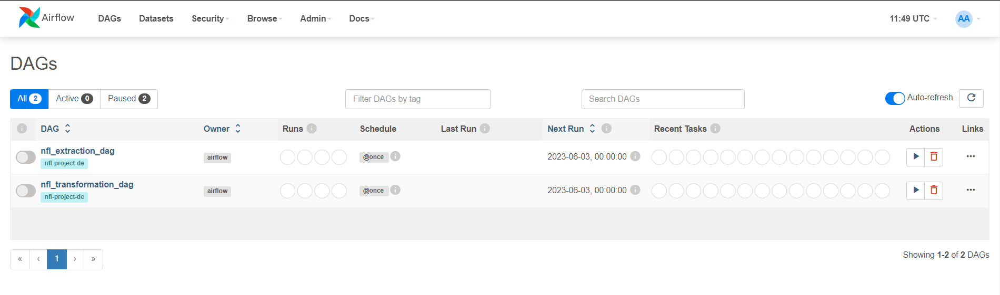
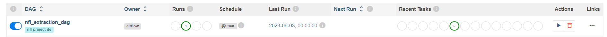

Prerequisites 
1. Create a GCP account with your Google email address. 

2. Setup your project named `nfl-project-de`. Take note of your `project ID`.

3. Download Google SDK

4. Download `setup_vm.sh` and `.env` file. Modify the `.env` file with your GCP Project details.
    - Modify the ~/nfl_project/terraform/variables_tf accordingly.
    - Setup GCP VM using the `setup_vm.sh`.
    - You will be prompted to choose your email and project. Select accordingly.
    - You will be asked to enable compute.googleapis.com API. Select `Y` option.
    - Input the following in your terminal:
      ```
      export $(grep -v '^#' .env | xargs)

      ./setup_vm.sh

      ssh $GCP_VM.$GCP_ZONE.$GCP_PROJECT_ID
      ```

- You should now be in the VM's shell

## In the VM
  1. Clone the repo and move to the repo directory to use the Makefile

      ```
      git clone https://github.com/rbblmr/nfl_project.git

      cd nfl_project
      ```

  2. Run this to have `make` avaiable as a command in the VM:

      ```
      sudo apt install make
      ```
  
  3. Install prerequisites:
    
      ```
      make prerequisites
      ```

  4. Exit the shell and start an SSH session again

      ```
      exit
      ```

      ```
      ssh $GCP_VM.$GCP_ZONE.$GCP_PROJECT_ID
      ```
  
  
  5. Initialize gcloud, choose to log in with new account (your gmail account):
    - You will be asked to login with a new account and will be redirected to a link to authenticate with your email account for Google SDK. Select your project after.
    - You will again be asked to authenticate with Google Auth Library, follow the link and authorize.

      ```
      cd nfl_project

      make gcloud-initialize
      ```
  
  6. Create terraform infrastructure:

      ```
      make terraform-infra
      ```

  7. Setup airflow:

      ```
      make airflow-setup
      ```

  8. Initialize gcloud within the airflow worker:
    - You will be asked to login with a new account and will be redirected to a link to authenticate with your email account for Google SDK. Select your project after.
    - You will again be asked to authenticate with Google Auth Library, follow the link and authorize.
      
      ```
      make airflow-gcloud-init
      ```
  
  9. Forward the 8080 port to access airflow in your browser. The easiest way to do this is in VSCode. You already have your config file when you used `gcloud compute config-ssh` in `setup_vm.sh`.

        a. Make sure you've installed `Remote-SSH` extension in VSCode

        b. Open a Remote Window and select `Connect to Host`
        
        c. Choose your $GCP_VM.$GCP_ZONE.$GCP_PROJECT_ID
        
        d. In the Terminal panel, choose ports and do port forwarding.
        
        e. You can now access the airflow UI in your browser

        Alternatively:
    
        Open another terminal session and move to the local location where you downloaded your .env in STEP 1 :

        ```
        export $(grep -v '^#' .env | xargs)

        ssh -L 8080:localhost:8080 $GCP_VM.$GCP_ZONE.$GCP_PROJECT_ID
        ```
        - You can now access `localhost:8080` in your browser
    
  10. In the airflow UI, enter the default credentials `username: airflow` `password:airflow` you should see two DAGs. Run them.
  
      a. Unpause the first DAG (nfl_extraction_dag) by clicking on the toggle button and WAIT for the run to finish before unpausing the second DAG (nfl_transformation_dag)
        
      - DAG home
          
      - 
      
      - You should see the following once it's finished running (9 tasks finished):
      
      - 

      b. Unpause the second DAG and wait for it to finish 

  11. You should now have your data in the Big Query data warehouse which you can access to create a dashboard in Tableau or any other tool.

