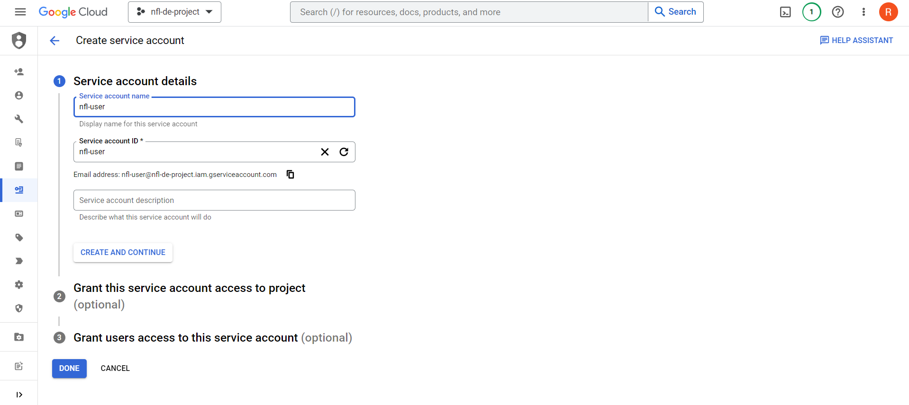

# **Environment setup**
 - For this project you'll need:
    - Google Cloud SDK
    - Docker with docker-compose
    - Terraform

# **Important Pre-requisites**

1. Terraform client installation: https://www.terraform.io/downloads
2. Cloud Provider account: https://console.cloud.google.com/

# **GCP**

1. Create an account with your Google email ID

2. Setup your project named `nfl-project-de`. Take note of your `project ID`.

3. Make a Service Account and grant it with the following roles:
    - 
    - 

    - BigQuery Admin
    - Storage Admin
    - Storage Object Admin
    - Storage Object Creator
    - Dataproc Worker
    - Dataproc Service Agent
    - Viewer

4. Download your Service Account credentials file and name it `google_credentials.json`
    - Store it in your project path, into a path like `~/.google/credentials/`

    - 

    - 

    - 

5. Enable the following APIs:
    - https://console.cloud.google.com/apis/library/iam.googleapis.com
    - https://console.cloud.google.com/apis/library/iamcredentials.googleapis.com
    - https://console.developers.google.com/apis/api/dataproc.googleapis.com/

6. In your CLI, create the environment variable for the path to your downloaded credentials `google_credentials.json`
    - name it `GOOGLE_APPLICATION_CREDENTIALS`

    ```
    export GOOGLE_APPLICATION_CREDENTIALS="~/.google/credentials/google_credentials.json"
    ```
7. Download [SDK](https://cloud.google.com/sdk/docs/quickstart) and choose the installer for your OS.

8. Initialize the SDK [following these instructions](https://cloud.google.com/sdk/docs/initializing)

    - IMPORTANT: In your MINGW/Git Bash CLI, enable `bash` by typing it in the command line
    - type `nano ~/.bashrc file` to edit the .bashrc file (located in your home directory `~` ) and append this at the end of the file:
    ```
    export GOOGLE_APPLICATION_CREDENTIALS="~/.google/credentials/google_credentials.json"
    ```
    - type `source ~/.bashrc` to enable the change 
        - Do this everytime you start a new session of you CLI
    
    - run `gloud init` and log in with your account 
    - choose the `nfl-project-de` when prompted

8. To obtain access credentials for your user account, run the following code and log in with the email associated with your google cloud:
    ```
    gcloud auth application-default login
    ```
9. You have set up your GCP! Let's build the infrastracture.

# **Running the Project using GCP Virtual Machine (LINUX)**

1. Generate ssh key used to log in on your gcp project
    - Open GitBash
    - Create ~/.ssh/ directory if not yet existent
    - Generate key using the following code
    ```
    ssh-keygen -t rsa -f ~/.ssh/gcp -C <username> -b 2048
    ```
    - Answer the prompt or leave them blank (default)
    - Private and public key (.pub) created (Don't share the private key)
    - Your keys are now located in `~/.ssh/`

2. Go to compute engine --> metadata--> ssh keys
    - Go to your CLI and open contents of your ssh key. Copy them.
    ```
    cat ~/.ssh/gcp.pub
    ```
    - Paste the contents of you `gcp.pub` key in the field
    - 

3. Create you VM instance and configure. Make sure you allocate enough boot disk storage.

4.  Take note of the External IP address and enter the following in your CLI:
    ```
    ssh -i ~/.ssh/gcp <username>@<externalipaddress>
    ```

5. Alternatively, you can create SSH access without using the console. You can do the following to create SSH access to your VM. Just make sure you have selected your project upon initializing the Google SDK using `gcloud auth application-default login`:
    ```
    gcloud compute config-ssh
    ```
    - This will create your ssh keys and a config file that will allow you to connect to VSCode later.
    - After running this, it should give you a code in the form of `ssh instance.region.project`
    - Copy the code and run it in your CLI. 
    - Your VM instance should now be accessible.
    - You can use the `instance.region.project` to open a remote window and connect to the VM in VSCODE (Optional)

6. The VM instance is now running. 

## Installing Anaconda and Docker within the VM
1. Update your VM in your ssh session
    ```
    sudo apt update && sudo apt -y upgrade
    ```

### Anaconda

1. In your SSH session, download Anaconda for Linux using this link: https://repo.anaconda.com/archive/Anaconda3-2023.03-1-Linux-x86_64.sh
    - This can be found here: https://www.anaconda.com/download
    ```
    wget https://repo.anaconda.com/archive/Anaconda3-2023.03-1-Linux-x86_64.sh
    ```
    - Note: You should currently be in your home or `~` directory. You can see the sh script by using `ls` 
2. Run the installer script and follow the prompts that will appear.  Wait for the installation to finish. The default location of installation folder should be in your home directory.
    ```
    bash Anaconda3-2023.03-1-Linux-x86_64.sh
    ```
3. For changes to take effect, logout of the session using `exit` and log back in. Enter `bash` and `(base)` will appear at the beginning of your command prompt. 
4. You can check that conda has been installed by running `conda --version`
5. After successful installation, remove the installer
    ```
    rm Anaconda3-2023.03-1-Linux-x86_64.sh
    ```
### Docker
1. Install docker using:
    ```
    sudo apt install docker.io
    ```
2. To run Docker without sudo:
    ```
    sudo groupadd docker

    sudo gpasswd -a $USER docker
    ```
3. Exit your SSH session and log back in.
4. Restart Docker daemon:
    ```
    sudo service docker restart
    ```
5. Test that docker is working properly:
    ```
    docker run hello-world
    ```

### Docker Compose
1. Install docker compose from docker compose github repo (`v.2.17.3`):
    ```
    # Create a bin folder in your `~` directory
    mkdir ~/bin
    
    # Go to bin directory
    cd ~/bin

    # Download docker compose
    wget https://github.com/docker/compose/releases/download/v2.17.3/docker-compose-linux-x86_64 -O docker-compose

2. Chmod to enable execution:
    ```
    chmod +x docker-compose
    ```
3. Run this code to check installation
    ```
    ./docker-compose --version
    ```
4. To run `docker-compose` anywhere, go back to home directory using `cd ~`
5. Do `nano .bashrc` to save your environment variables. 
    - Within the file, append the following at the end of the file:
    ```
    export PATH="${HOME}/bin:${PATH}"
    ```
    - Save and exit. (CTRL+S, CTRL+X)
6. For the changes to take effect, do `source .bashrc`
7. Try running `docker-compose`
### Terraform

1. Run the following:
    ```
    curl -fsSL https://apt.releases.hashicorp.com/gpg | sudo apt-key add -

    sudo apt-add-repository "deb [arch=amd64] https://apt.releases.hashicorp.com $(lsb_release -cs) main"

    sudo apt-get update && sudo apt-get install terraform
    ```
2. Verify the installation:
    ```
    terraform --version
    ```
### Clone the repo within your VM

1. Clone the contents of this project repo in your `~` directory. (Do `cd ~` if you're not there.) 

     ```
    git clone https://github.com/achi08rbb/NFL_DE_PROJECT.git
    ```
    - It should look something like this: 
    - 
2. You can securely copy your credentials from you local machine to your remote VM instance using the following:
    - Within your ssh session:
    ```
    mkdir -p ~/.google/credentials/
    ```
    - In your local CLI (Open a new window of GitBash or your chosen CLI):
    ```
    scp ~/.google/credentials/google_credentials.json <instance.region.project>:~/.google/credentials/
    ```
3. In your SSH session,
    - Type `nano ~/.bashrc file` to edit the .bashrc file (located in your home directory `~` ) and append this at the end of the file:
    ```
    export GOOGLE_APPLICATION_CREDENTIALS="~/.google/credentials/google_credentials.json"
    ```
    - Type `source ~/.bashrc` to enable the change 
        - Do this everytime you start a new session of you CLI
    
    - Run `gloud init` and log in with your account, choose login with new gmail account (if your account is not shown). Follow the given link and authorize with the gmail account associated with the project.
    - Choose the `nfl-project-de` when prompted

    <!-- - To obtain access credentials for your user account, run the following code and log in with the email associated with your google cloud:
    ```
    gcloud auth application-default login
    ``` -->
4. Finished authorizing and installing. Let's build the infrastracture!

# **Terraform**
- Set up your GCP infrastracture using terraform
- The following resources will be created:

    1. Big Query: Data Warehouse
    2. Google Cloud Storage: Data Lake
    3. Google Dataproc: Spark Cluster (for running spark jobs)

1. After installing terraform, follow this guide: https://developer.hashicorp.com/terraform/tutorials/gcp-get-started/install-cli

2. Modify the project variables in the `variables.tf` according to your GCP Project ID and other details (Region, Data Lake name, etc.).

3. Go to your CLI and `cd` to the terraform folder in the cloned project repo
    ```
    cd ~/NFL_DE_PROJECT/terraform
    ```

4. Follow these execution steps:
    ```
    # Initialize state file (.tfstate)
    terraform init

    # Check changes to new infra plan
    terraform plan -var="project=<your-gcp-project-id>"
    
    # Create new infra, this usually takes around 2 mins to complete
    terraform apply -var="project=<your-gcp-project-id>"

    # Delete infra after your work, to avoid costs on any running services
    terraform destroy
    ```

5. In case you get an error: refer to the guide: [terraform installation guide](https://developer.hashicorp.com/terraform/tutorials/gcp-get-started/install-cli): 
    ```
    If you get an error that terraform could not be found, your PATH environment variable was not set up properly. Please go back and ensure that your PATH variable contains the directory where Terraform was installed.
    ```

# **Airflow**
Prerequisites:
- Docker and docker compose 

1. Go to your main project directory and move to the airflow folder
    
    ```
    cd ~/NFL_DE_PROJECT/airflow
    ```

2. Make sure you've done `source ~/.bashrc`, as instructed in [GCP](#gcp) setup section, to have your GOOGLE_APPLICATION_CREDENTIALS available in the session.
3. Make sure you change the variables within the `airflow/dags/data_ingestion.py` like your Project ID and Bucket.
3. Make the required directories for setting up airflow
    
    ```bash
    mkdir -p ./dags ./logs ./plugins
    ```

4. Make sure the dockerfile and docker-compose.yaml file is in the current working directory, which should be the airflow folder directory


    i. Start docker daemon by opening Docker Desktop in Windows and run the following in your CLI

    ```
    echo -e "AIRFLOW_UID=$(id -u)" > .env
    ```

    ii. Build the image
    
    ```
    docker-compose build
    ```
    or (for legacy versions)
    ```
    docker build .
    ```    
    iii. Initialize the Airflow scheduler, DB, and other config
    ```
    docker-compose up airflow-init
    ```    
    iv. Kick up the all the services from the container:
    ```
    docker-compose up
    ```    
    v. In another terminal, run docker-compose ps to see which containers are up & running (there should be 7, matching with the services in your docker-compose file).
     ```
    docker ps
    ```

    vi. On finishing your run or to shut down the container/s:
    ```
    docker-compose down
    ```
    vii. To stop and delete containers later on, delete volumes with database data, and download images, run:

    ```
    docker-compose down --volumes --rmi all
    
    or

    docker-compose down --volumes --remove-orphans
    ```

5. Login to Airflow web UI on localhost:8080 with default creds: airflow/airflow
    - If you can't access localhost:8080 you may need to forward ports of your VM machine to your local machine
    - The easiest way to do this is to connect your VM to VSCODE and forward ports there:
        - Open a remote window by clicking the bottom-left icon (><) and choose connect to Host (Remote-SSH)
            - 
        - Forward port for Airflow webserver (8080):
            - 
        - You should now be able to access localhost:8080 in your browser
    

6. To check if your credentials are right where they should be. Look for the airflow worker container id using `docker ps` (In another SSH session) and run the following (Make sure you're in your airflow folder where you docker-compose.yaml file is found):
   
    ```
    docker exec -it <container-id-of-airflow-worker> bash
    ```

    - You can now navigate within the container as you would in your own local setup.
    
    - Make sure to run the following code inside the airflow worker container so you could use gsutil (within airflow container) later:
            
    ```
    gcloud init
    ```
    ```
    gcloud auth application-default login
    ```
    Choose your account and project when prompted.

7. You can choose to run the DAGs for different years, just change the params in the parameter section of the DAG in `airflow/dags/data_ingestion.py`. If airflow was setup correctly, changes within the DAG (on your local copy) should sync with the DAG in the docker container.

8. Change your bucket variable in the `airflow/code/transform_pyspark.py`.

9. Run the 2 dags separately, in this order:
    1. `nfl_extract_load_GCS` 
    2. `nfl_transform_load_BQ` 
