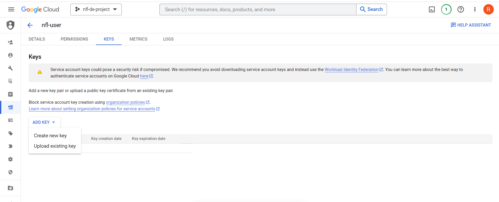
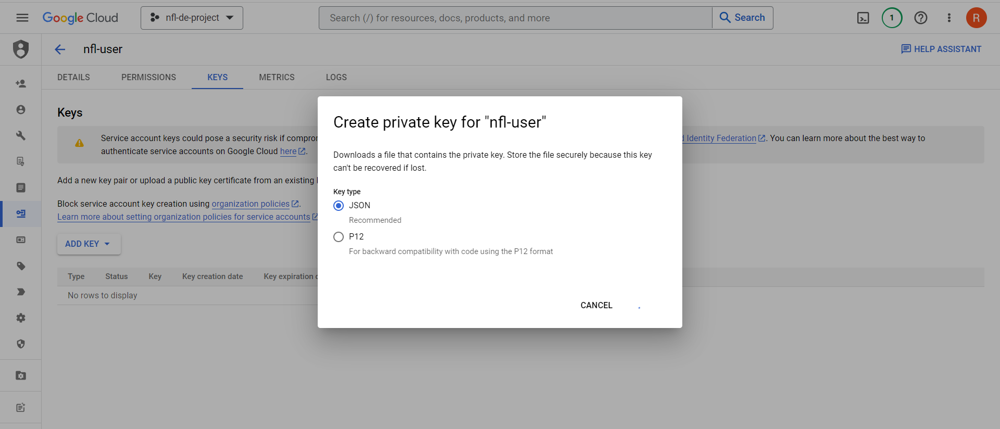

# **Environment setup**
 - For this project you'll need:
    - Google Cloud SDK
    - Docker with docker-compose
    - Terraform

# **Important Pre-requisites**

1. Terraform client installation: https://www.terraform.io/downloads
2. Cloud Provider account: https://console.cloud.google.com/
3. Docker and docker-compose: https://docs.docker.com/compose/install/ (installing Docker Desktop would install docker-compose)
4. Clone the contents of this repo in your device 
    - Open a terminal or command prompt on your computer.
    - Navigate to the directory where you want to clone the repository.
    - Use the git clone command followed by the URL of the repository you want to clone. 
        ```
        git clone https://github.com/achi08rbb/NFL_DE_PROJECT.git
        ```
    - It should look something like this: 
    
    - 
    - In this case the repo is located in the `7ProjectAirflow` directory:

5. If running on windows, use MINGW/Git Bash for the commands shown here
# Running using Virtual Machine

1. Generate ssh key used to log in on your gcp project
    - Open GitBash
    - Create ~/.ssh/ directory if not yet existent
    - Generate key using the following code
    ```
    ssh-keygen -t rsa -f ~/.ssh/gcp -C <username> -b 2048
    ```
    - Answer the prompt or leave them blank (default)
    - Private and public key (.pub) created (Don't share the private key)
    - Your keys are now located in `~/.ssh/`

2. Go to compute engine --> metadata--> ssh keys
    - Go to your CLI and open contents of your ssh key. Copy them.
    ```
    cat ~/.ssh/gcp.pub
    ```
    - Paste the contents of you `gcp.pub` key in the field
    - 

3. Create you VM instance and configure
4. 

# **GCP**

1. Create an account with your Google email ID

2. Setup your project named `nfl-project-de`. Take note of your `project ID`.

3. Make a Service Account and grant it with the following roles:
    - 
    - 

    - BigQuery Admin
    - Storage Admin
    - Storage Object Admin
    - Storage Object Creator
    - Dataproc Worker
    - Dataproc Service Agent
    - Viewer

4. Download your Service Account credentials file and name it `google_credentials.json`
    - Store it in your project path, into a path like `<project-path>/.google/credentials/`

    - 

    - 

    - 

5. Enable the following APIs:
    - https://console.cloud.google.com/apis/library/iam.googleapis.com
    - https://console.cloud.google.com/apis/library/iamcredentials.googleapis.com
    - https://console.developers.google.com/apis/api/dataproc.googleapis.com/

6. In your CLI, create the environment variable for the path to your downloaded credentials `google_credentials.json`
    - name it `GOOGLE_APPLICATION_CREDENTIALS`
    - For uniformity, put your credentials in the remote copy of the cloned repository as noted in the [Local Setup section](#local-setup-for-terraform-and-gcp)
    ```
    <project-path>/airflow
    ```
    
    ```
    export GOOGLE_APPLICATION_CREDENTIALS="<project-path>/.google/credentials/google_credentials.json"
    ```
7. Download [SDK](https://cloud.google.com/sdk/docs/quickstart) and choose the installer for your OS.

8. Initialize the SDK [following these instructions](https://cloud.google.com/sdk/docs/initializing)

    - IMPORTANT: In your MINGW/Git Bash CLI, enable `bash` by typing it in the command line
    - type `nano ~/.bashrc file` to edit the .bashrc file (located in your home directory `~` ) and append this at the end of the file:
    ```
    export GOOGLE_APPLICATION_CREDENTIALS="<project-path>/.google/credentials/google_credentials.json"
    ```
    - type `source ~/.bashrc` to enable the change 
        - Do this everytime you start a new session of you CLI
    
    - run `gloud init` and log in with your account 
    - choose the `nfl-project-de` when prompted

8. To obtain access credentials for your user account, run the following code and log in with the email associated with your google cloud:
    ```
    gcloud auth application-default login
    ```
9. You have set up your GCP! Let's build the infrastracture.


# **Terraform**
- Set up your GCP infrastracture using terraform
- The following resources will be created:

    1. Big Query: Data Warehouse
    2. Google Cloud Storage: Data Lake
    3. Google Dataproc: Spark Cluster (for running spark jobs)

1. After installing terraform, follow this guide: https://developer.hashicorp.com/terraform/tutorials/gcp-get-started/install-cligo 

2. Modify the project variables in the `variables.tf` according to your GCP Project ID.

3. Go to your CLI and `cd` to the terraform folder in the cloned project repo
    ```
    cd <project-path>/terraform
    ```

4. Follow these execution steps:
    ```
    # Initialize state file (.tfstate)
    terraform init

    # Check changes to new infra plan
    terraform plan -var="project=<your-gcp-project-id>"
    
    # Create new infra, this usually takes around 2 mins to complete
    terraform apply -var="project=<your-gcp-project-id>"

    # Delete infra after your work, to avoid costs on any running services
    terraform destroy
    ```

5. In case you get an error: refer to the guide: [terraform installation guide](https://developer.hashicorp.com/terraform/tutorials/gcp-get-started/install-cli) : 
    ```
    If you get an error that terraform could not be found, your PATH environment variable was not set up properly. Please go back and ensure that your PATH variable contains the directory where Terraform was installed.
    ```

# **Airflow**
Prerequisites:
- Docker and docker compose 

1. Go to your main project directory and move to the airflow folder
    
    ```
    cd <project-path>/airflow
    ```

2. Make sure you've done `source ~/.bashrc`, as instructed in [GCP](#gcp) setup section, to have your GOOGLE_APPLICATION_CREDENTIALS available in the session.
3. Make sure you change the variables within the `airflow/dags/data_ingestion.py` like your Project ID and Bucket.
3. Make the required directories for setting up airflow
    
    ```bash
    mkdir -p ./dags ./logs ./plugins
    ```

4. Make sure the dockerfile and docker-compose.yaml file is in the current working directory, which should be the airflow folder directory


    i. Start docker daemon by opening Docker Desktop in Windows and run the following in your CLI

    ```
    echo -e "AIRFLOW_UID=$(id -u) > .env
    ```

    ii. Build the image
    
    ```
    docker-compose build
    ```
    or (for legacy versions)
    ```
    docker build .
    ```    
    iii. Initialize the Airflow scheduler, DB, and other config
    ```
    docker-compose up airflow-init
    ```    
    iv. Kick up the all the services from the container:
    ```
    docker-compose up
    ```    
    v. In another terminal, run docker-compose ps to see which containers are up & running (there should be 7, matching with the services in your docker-compose file).

    vi. Login to Airflow web UI on localhost:8080 with default creds: airflow/airflow
    
    vii. On finishing your run or to shut down the container/s:
    ```
    docker-compose down
    ```
    viii. To stop and delete containers later on, delete volumes with database data, and download images, run:

    ```
    docker-compose down --volumes --rmi all
    
    or

    docker-compose down --volumes --remove-orphans
    ```

    ix. To check if your credentials are right where they should be, run:


    ```
    docker ps
    ```

    x. Look for the airflow worker container id and run the following (Make sure you're in your airflow folder where you docker-compose.yaml file is found):
   
    ```
    docker exec -it <container-id-of-airflow-worker> bash
    ```

    You can now navigate within the container as you would in your own local setup.
    Make sure to run the following code inside the airflow worker container so you could use gsutil (within airflow container) later:
            
    ```
    gcloud init
    ```
    Choose your project when prompted.
    ```
    gcloud auth application-default login
    ```
    
5. You can choose to run the DAGs for different years, just change the params in the parameter section of the dag in `airflow/dags/data_ingestion.py`. If airflow was setup correctly, changes within the DAG (on your local copy) should sync with the dag in the docker container.

6. Change your bucket variable in the `airflow/code/transform_pyspark.py`.

7. Run the 2 dags separately, in this order:
    1. `nfl_extract_load_GCS` 
    2. `nfl_transform_load_BQ` 
